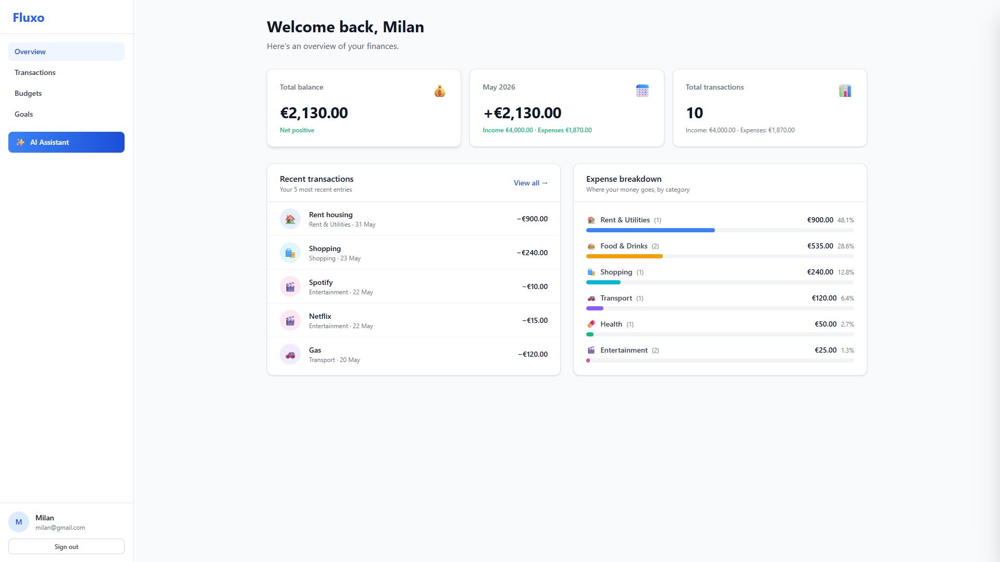
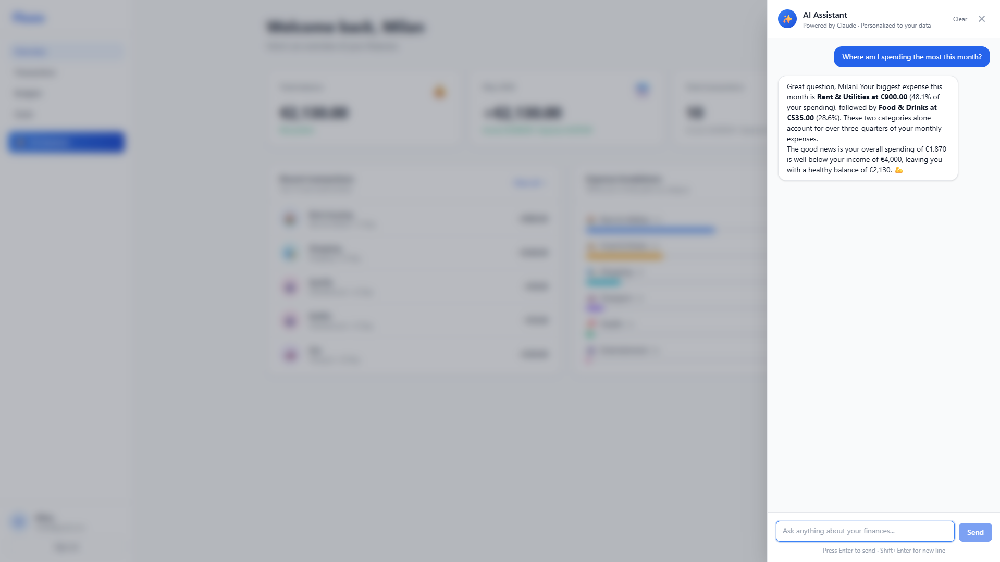
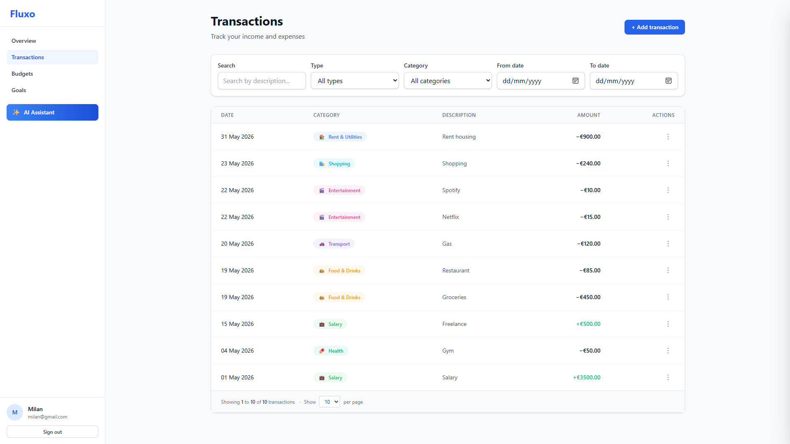
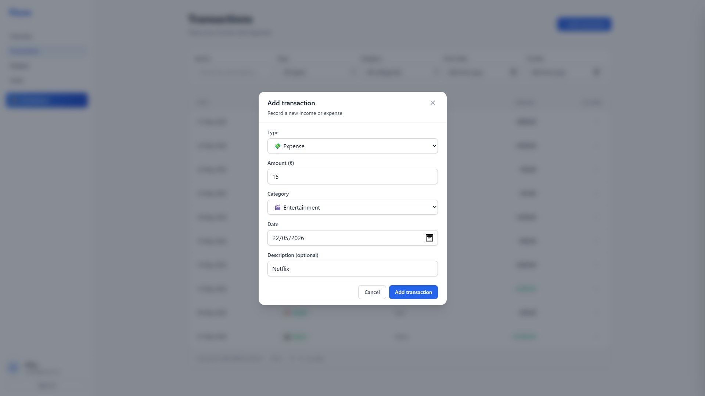
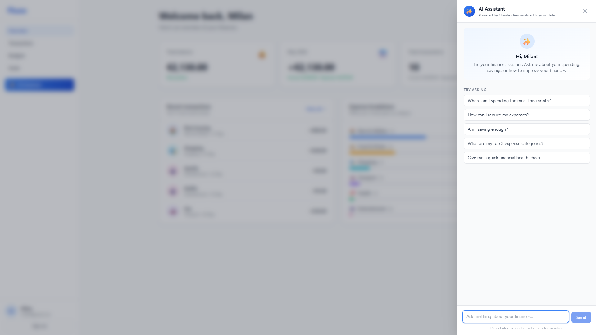
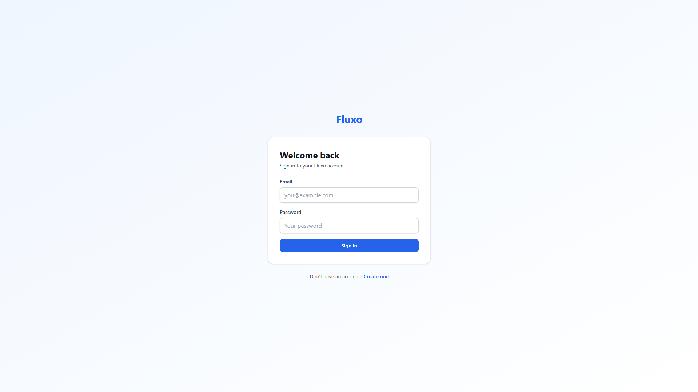

# 💸 Fluxo — AI-Powered Personal Finance Dashboard

> Modern personal finance dashboard with streaming AI assistant powered by Claude. Track expenses, analyze spending patterns, and get personalized financial insights.

---

## ✨ Highlights

🎯 **AI Assistant powered by Claude** — Streaming chat with personalized financial insights based on your actual transaction data

🔐 **Production-grade authentication** — JWT access tokens, HTTP-only refresh cookies, automatic rotation, rate limiting, Argon2id password hashing

⚡ **End-to-end type safety** — Shared Zod schemas between frontend and backend via pnpm monorepo

🏗️ **Modern architecture** — React 19, Fastify 5, Prisma 7 with adapter pattern, PostgreSQL 17

---

## 📸 Screenshots

### Dashboard with Real-Time Stats

### AI Assistant — Streaming Response with Personalized Context

### Transaction Management with Filters & Pagination

### Add Transaction — Type-Safe Form with Zod Validation

### AI Assistant Welcome Screen

### Authentication

---

## 🛠️ Tech Stack

### Frontend
- **React 19** with TypeScript 5.7 strict mode
- **Vite 6** for fast development
- **Redux Toolkit + RTK Query** for state management and data fetching
- **Tailwind CSS 4** (Oxide engine) for styling
- **React Router 7** for routing
- **React Markdown** for AI response rendering
- **Async Mutex** for token refresh synchronization

### Backend
- **Node.js 22 + Fastify 5** for high-performance HTTP server
- **PostgreSQL 17 + Prisma 7** with adapter pattern
- **JWT** access tokens + **HTTP-only signed cookies** for refresh tokens
- **Argon2id** password hashing (OWASP recommended)
- **Anthropic SDK** for Claude integration with streaming responses
- **Pino** for structured logging

### Infrastructure
- **pnpm workspaces + Turborepo** for monorepo management
- **Docker Compose** for local PostgreSQL
- **Zod** for runtime validation everywhere

---

## 🎬 Key Features

### Implemented ✅

- **Full Authentication** — Register, login, logout with automatic token refresh and rotation
- **Transaction CRUD** — Create, edit, delete with category assignment and confirmation dialogs
- **Smart Filtering** — Search with debouncing, type filter, date range, category filter, pagination
- **Dashboard Analytics** — Real-time stats, category breakdown with percentages, recent transactions widget
- **AI Assistant** — Streaming Server-Sent Events chat with Claude, user-context injection (transactions + stats), conversation history, markdown rendering
- **Multi-tenant Security** — Ownership checks on all resources, RTK Query cache reset on auth changes
- **Default Categories** — Auto-seeded on registration for new users
- **Migration Support** — Script to backfill default categories for existing users

### Planned 🔜

- Budget tracking with category limits and alerts
- Savings goals with progress visualization
- Recurring transactions
- Data export (CSV, JSON)
- Dark mode
- Internationalization (English/Serbian)

---

## 🏗️ Architecture

See [docs/ARCHITECTURE.md](./docs/ARCHITECTURE.md) for detailed technology decisions and reasoning.

### Notable Patterns

- **End-to-end type safety** via shared Zod schemas (`packages/shared`)
- **Optimistic UI** with RTK Query cache invalidation
- **Token refresh mutex** to prevent race conditions during simultaneous 401s
- **Server-Sent Events (SSE)** for AI streaming with `AbortController` for cancellation
- **Adapter pattern in Prisma 7** for future edge deployment compatibility

---

## 🚀 Getting Started

### Prerequisites
- Node.js 22+
- pnpm 10+
- Docker Desktop (for local PostgreSQL)
- Anthropic API key ([get one here](https://console.anthropic.com))

### Installation

\`\`\`bash
# Clone the repository
git clone https://github.com/milanNbg/fluxo.git
cd fluxo

# Install dependencies
pnpm install

# Start PostgreSQL
docker compose up -d

# Set up environment variables
cp apps/api/.env.example apps/api/.env
cp apps/web/.env.example apps/web/.env
# Edit apps/api/.env and add your ANTHROPIC_API_KEY

# Run database migrations
pnpm --filter @fluxo/api exec prisma migrate dev
\`\`\`

### Development

\`\`\`bash
# Start backend (http://localhost:3000)
pnpm --filter @fluxo/api dev

# Start frontend (http://localhost:5173)
pnpm --filter @fluxo/web dev
\`\`\`

### Health Check

\`\`\`bash
curl http://localhost:3000/health/ready
\`\`\`

Expected response:

\`\`\`json
{
  "status": "ready",
  "checks": { "server": "ok", "database": "ok" }
}
\`\`\`

---

## 📂 Project Structure

\`\`\`
fluxo/
├── apps/
│   ├── web/                 # React frontend
│   │   ├── src/
│   │   │   ├── app/         # Redux store, RTK Query API
│   │   │   ├── components/  # Shared components
│   │   │   ├── features/    # Feature modules (auth, transactions, ai)
│   │   │   └── pages/       # Route pages
│   │   └── ...
│   └── api/                 # Fastify backend
│       ├── src/
│       │   ├── config/      # Environment validation
│       │   ├── lib/         # Database client, helpers
│       │   ├── plugins/     # Fastify plugins (auth, errors)
│       │   ├── routes/      # HTTP route handlers
│       │   └── services/    # Business logic
│       └── prisma/          # Schema and migrations
├── packages/
│   └── shared/              # Shared Zod schemas + TS types
├── docs/
│   ├── ARCHITECTURE.md      # Technology decisions
│   └── screenshots/         # Application screenshots
├── docker-compose.yml
└── ...
\`\`\`

---

## 🔒 Security Practices

- **Argon2id** password hashing (OWASP recommendation)
- **JWT access tokens** (15 min) + **HTTP-only refresh cookies** (7 days) hybrid pattern
- **Refresh token rotation** — old token revoked in DB on every refresh
- **Rate limiting** on auth endpoints (5 attempts per 15 min)
- **Signed cookies** with strong secret to prevent tampering
- **Helmet** for security headers
- **CORS** properly configured with credentials and exact origin
- **Multi-tenant isolation** — every resource query includes \`userId\` constraint
- **Environment validation** with Zod at startup (fail fast)

---

## 📜 License

MIT © [milanNbg](https://github.com/milanNbg)

---

**Built with ❤️ as a portfolio project demonstrating modern full-stack TypeScript development.**